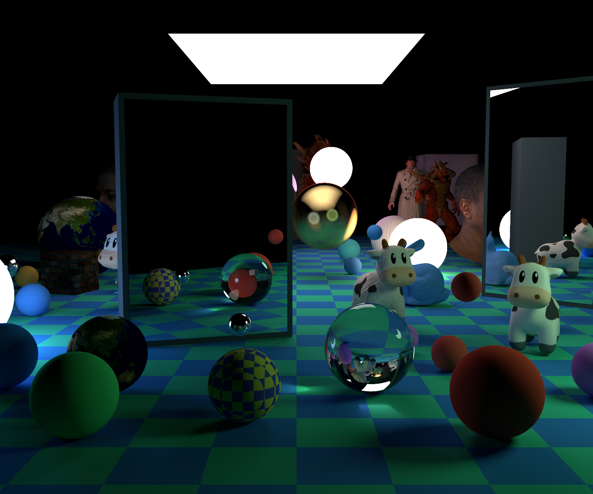
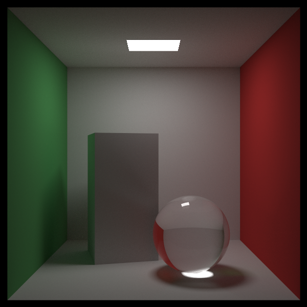
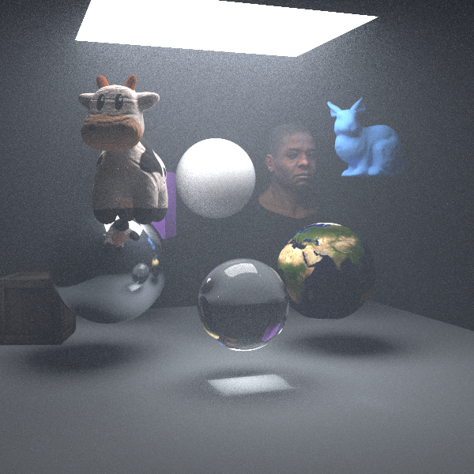

<div align="center">

# CPUPathTracer

**使用现代 C++ 编写的 CPU 多线程离线路径追踪器**

[English](README.md) | [简体中文](README_zh-CN.md)




</div>

CPUPathTracer 是一个使用 C++17 实现的 CPU 离线渲染器，用于完整实践路径追踪的核心流程。项目在较紧凑的代码结构中集成了光线传输、重要性采样、分层加速结构、带纹理的 OBJ 模型、参与介质和具有确定性结果的 OpenMP 并行渲染。

## 功能亮点

- **路径追踪：** 递归间接光照、自发光几何体、单样本多重重要性采样和俄罗斯轮盘终止。
- **两级加速结构：** 场景物体与三角形网格均支持分桶 SAH BVH，同时保留中位数划分用于效果对比。
- **OBJ 资源管线：** 支持 OBJ/MTL、三角形求交、平滑法线生成、平滑组、纹理坐标和模型实例复用。
- **表面细节：** 图像纹理与程序纹理、双线性过滤、法线贴图、凹凸贴图和真实顶点位移。
- **材质与介质：** 漫反射、金属、玻璃、自发光材质，以及均匀参与介质和各向异性相位散射。
- **CPU 并行：** OpenMP 负责 16 × 16 Tile 调度；支持逐像素确定性随机采样、渐进式 PPM 输出，并默认限制为逻辑处理器数量的 80%。
- **可复现场景：** 提供三个固定场景，分别用于基础验证、单项功能观察和最终集成测试。

## 渲染效果

<table>
  <tr>
    <td width="50%"></td>
    <td width="50%"></td>
  </tr>
  <tr>
    <td align="center"><b>场景 1 · 基础盒体</b><br>面光源、间接光照、玻璃与漫反射表面</td>
    <td align="center"><b>场景 2 · 材质展示</b><br>OBJ 模型、纹理、表面细节与参与介质</td>
  </tr>
</table>

<p align="center">
  
  <br><b>场景 3 · 最终展示</b><br>
  多光源、镜面、混合材质、模型变换与两级 SAH BVH 加速
</p>

## 渲染流程

```text
相机与确定性像素采样器
          │
          ▼
   OpenMP Tile 调度
          │
          ▼
递归路径积分 ── MIS ── 俄罗斯轮盘
          │
          ▼
  场景级 SAH BVH
          │
          ▼
  网格级 SAH BVH
          │
          ▼
渐进式帧缓冲区 → 自动编号的 PPM 图片
```

遇到非镜面反弹时，积分器以相同概率选择光源采样或材质采样，再使用当前配置的 Balance Heuristic 或 Power Heuristic 计算权重。俄罗斯轮盘只在指定路径深度之后启用，在保持估计无偏的同时减少低贡献路径的计算量。

## 编译与运行

### 环境要求

- Windows 10/11
- CMake 3.16 或更高版本
- 支持 OpenMP 的 C++17 编译器
- 仓库内的 VS Code 配置推荐使用 MinGW-w64 GCC

### 终端运行

```powershell
git clone https://github.com/YeeeeeFun/CPUPathTracer.git
cd CPUPathTracer

cmake -S . -B build -G "MinGW Makefiles" -DCMAKE_BUILD_TYPE=Release
cmake --build build --parallel 8
.\build\rttroyl.exe
```

渲染结果会自动保存到 `results/new5070-N.ppm`。程序会自动寻找下一个编号，不会覆盖已有图片。终端会显示构建类型、加速与采样模式、渲染进度、线程数量、路径统计和总运行时间。

### VS Code

使用 VS Code 打开仓库根目录，在“运行和调试”面板中选择 **Run Ray Tracing (Release + OpenMP)**。现有任务会在运行前自动配置并编译 Release 版本。如果 MinGW 安装在其他位置，需要修改 `.vscode/tasks.json` 和 `.vscode/launch.json` 中的工具路径。

## 参数配置

常用参数集中在 [`main.cpp`](main.cpp) 顶部的 `render_config` 中：

| 参数 | 作用 |
| --- | --- |
| `scene_id` | 切换场景 `1`、`2`、`3` |
| `image_width` | 输出图片宽度，高度由宽高比计算 |
| `samples_per_pixel` | 每像素采样数，数值越高通常噪点越少 |
| `max_depth` | 光线路径的最大深度 |
| `sampling_heuristic` | 切换 Balance 或 Power MIS 权重 |
| `obj_bvh_method` / `world_bvh_method` | 切换 SAH 或中位数 BVH 构建方式 |
| `enable_world_bvh` | 是否启用场景级加速结构 |
| `russian_roulette` | 启用终止策略，并设置开始深度与存活概率范围 |
| `enable_showcase_fog` | 开关场景 2 的体积介质 |
| `enable_final_global_fog` | 开关场景 3 的全局雾气 |
| `enable_final_ceiling_light` | 开关场景 3 的顶部面光源 |
| `final_ceiling_light_intensity` | 调整顶部面光源强度 |
| `final_sphere_light_intensity` | 调整发光球强度 |

渲染器默认最多使用可用逻辑处理器的 80%。如果希望进一步减少单次运行使用的线程数：

```powershell
$env:RT_NUM_THREADS = "8"
.\build\rttroyl.exe
```

该环境变量只能降低线程数量，不能突破程序内置的 80% 上限。

## 项目结构

```text
.
├── main.cpp                 # 公共渲染参数与场景选择
├── scenes.h                 # 场景构建
├── camera.h                 # 相机、路径积分器与 OpenMP 渲染循环
├── bvh.h                    # 中位数与分桶 SAH BVH
├── triangle.h               # 三角形求交与顶点属性
├── obj_model.*              # OBJ/MTL 加载与网格构建
├── material.h               # 表面材质与相位函数
├── texture.h                # 图像纹理与程序纹理
├── displacement.h           # 法线、凹凸和位移处理
├── constant_medium.h        # 均匀参与介质
├── models/                  # 网格与纹理资源
├── external/                # 头文件形式的第三方依赖
└── docs/images/             # README 使用的渲染结果
```

## 前置知识

阅读项目代码前，可以先了解以下基础内容：

- [软件光栅化与三角形网格基础](https://haqr.eu/tinyrenderer/)
- [光线追踪与路径追踪基础](https://raytracing.github.io/)

## 项目范围

本项目专注于 CPU 离线路径追踪，不包含实时 UI、GPU 后端、降噪器或完整的生产级 PBR 材质系统。较明确的范围可以让采样、加速结构、几何体、材质和并行渲染代码保持直观，便于阅读和实验。

## 第三方组件与模型资源

- 使用 `tiny_obj_loader.h` 解析 OBJ/MTL 文件。
- 使用 `stb_image.h` 解码纹理图片。
- 模型目录中已有的来源与授权说明文件均予以保留。

